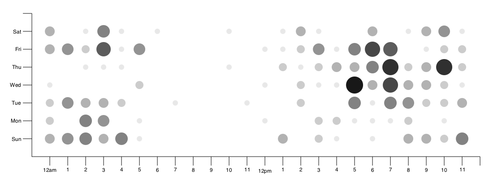
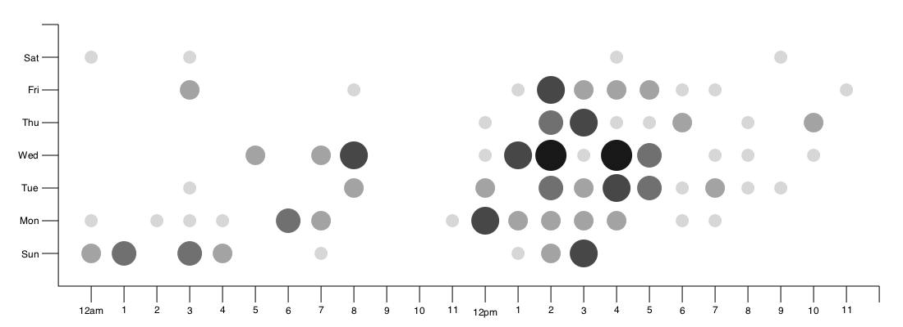

# autoupdate_punchcard

**対象のリポジトリのコミットを検知してpunchcardの画像を自動で更新しているリポジトリ**

いつのまにか消えてしまったGithubのpunchcard機能を[N0nki/git-punchcard-plot](https://github.com/N0nki/git-punchcard-plot)で再現しています。  

## dotfiles

## proposal_packages

